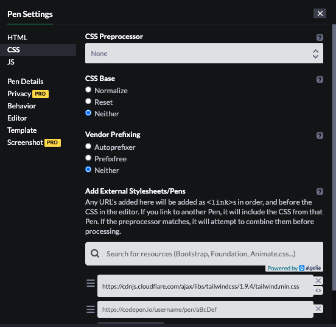
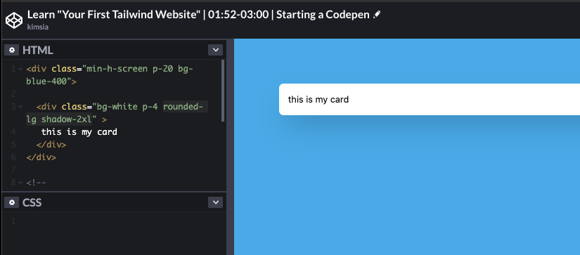
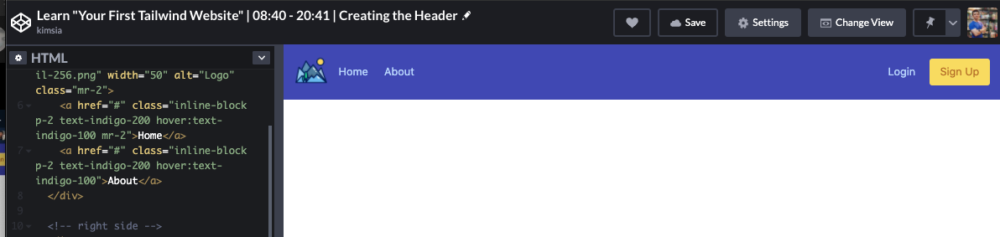
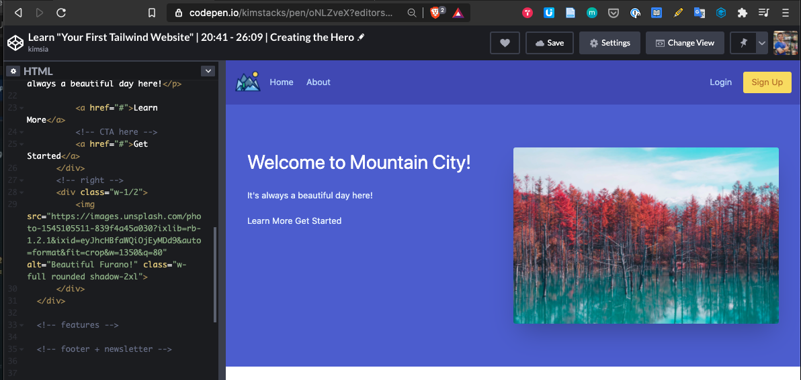
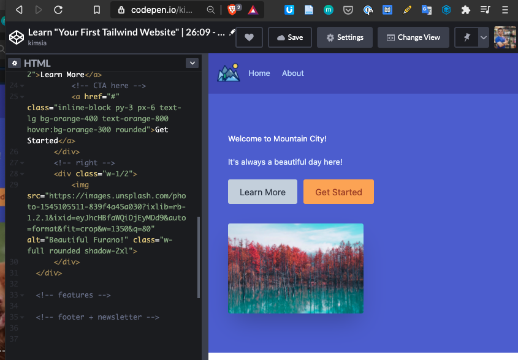

# learn-your-first-tailwind-website
Doing this on codepen

The canonical website is a youtube video https://www.youtube.com/watch?v=NRagrTU_v8o&feature=emb_logo

## Timestamps and branches

- [0:00](https://www.youtube.com/watch?v=NRagrTU_v8o&feature=emb_logo) - Intro
- [0:31](https://youtu.be/NRagrTU_v8o?t=31) - Tailwind Introduction
- [1:52](https://youtu.be/NRagrTU_v8o?t=112) - Starting a CodePen [branch 0152-0300/starting-a-codepen](https://github.com/simkimsia/learn-your-first-tailwind-website/tree/0152-3000/starting-a-codepen)
- [3:00](https://youtu.be/NRagrTU_v8o?t=180) - Tailwind vs Bootstrap [branch 0300-0742/tailwind-vs-bootstrap](https://github.com/simkimsia/learn-your-first-tailwind-website/tree/0300-0742/tailwind-vs-bootstrap)
- [7:47](https://youtu.be/NRagrTU_v8o?t=467) - Starting our Landing Page
- [8:40](https://youtu.be/NRagrTU_v8o?t=520) - Creating the Header [branch 0840-2041/creating-the-header](https://github.com/simkimsia/learn-your-first-tailwind-website/tree/0840-2041/creating-the-header)
- [20:41](https://youtu.be/NRagrTU_v8o?t=1241) - Creating the Hero [branch 2041-2609/creating-the-hero](https://github.com/simkimsia/learn-your-first-tailwind-website/tree/2041-2609/creating-the-hero)
- [26:09](https://youtu.be/NRagrTU_v8o?t=1569) - Responsive Styles [branch 2609-3051/responsive-styles]()
- [30:51](https://youtu.be/NRagrTU_v8o?t=1851) - Creating the Features [branch 3051-3611/starting-a-codepen]()
- [36:11](https://youtu.be/NRagrTU_v8o?t=2171) - Creating the Footer [branch 3611/starting-a-codepen]()

## Lessons

### Lesson 1 - Starting a Codepen

- [1:52](https://youtu.be/NRagrTU_v8o?t=112) - Starting a CodePen [branch 0152-0300/starting-a-codepen]()

### Lesson 2 - Tailwind vs Bootstrap

- [3:00](https://youtu.be/NRagrTU_v8o?t=180) - Tailwind vs Bootstrap [branch 0300-0742/tailwind-vs-bootstrap](https://github.com/simkimsia/learn-your-first-tailwind-website/tree/0300-0742/tailwind-vs-bootstrap)
- [codepen final outcome](https://codepen.io/kimstacks/pen/JjKKoKj)

### Lesson 3 - Creating the Header

- [8:40](https://youtu.be/NRagrTU_v8o?t=520) - Creating the Header [branch 0840-2041/creating-the-header](https://github.com/simkimsia/learn-your-first-tailwind-website/tree/0840-2041/creating-the-header)
- [codepen final outcome](https://codepen.io/kimstacks/pen/QWEdRJV?editors=1000)

### Lesson 4 - Creating the Hero

- image from Photo by [Jarrett Kow](https://unsplash.com/@haskel?utm_source=unsplash&utm_medium=referral&utm_content=creditCopyText) on [Unsplash](https://unsplash.com/s/photos/furano?utm_source=unsplash&utm_medium=referral&utm_content=creditCopyText)
- [20:41](https://youtu.be/NRagrTU_v8o?t=1241) - Creating the Hero [branch 2041-2609/creating-the-hero](https://github.com/simkimsia/learn-your-first-tailwind-website/tree/2041-2609/creating-the-hero)
- [codepen final outcome](https://codepen.io/kimstacks/pen/oNLZveX?editors=1000)

### Lesson 5 - Responsive Styles

- [26:09](https://youtu.be/NRagrTU_v8o?t=1569) - Responsive Styles [branch 2609-3051/responsive-styles](https://github.com/simkimsia/learn-your-first-tailwind-website/tree/2609-3051/responsive-styles)
- [codepen final outcome](https://codepen.io/kimstacks/pen/wvWJwNm?editors=1000)

